# 开发一个DNF手游自动化搬砖脚本（逐行代码讲解）

## 前言：本文主要使用 YOLOv5 识别游戏画面中的物体，结合 ADB 命令控制手机操作，实现自动化技能释放、拾取物品、寻路和再次挑战等功能，彻底解放双手。本文旨在学习和分析技术思路，不涉及任何商业用途，手把手安装环境，实现代码逐行讲解，0基础也可以跟着做。

## 

## 第二期  [实现Dnfm手游脚本搬砖思路 2 （逐行代码讲解） - 知乎 (zhihu.com)](https://zhuanlan.zhihu.com/p/714876356)

## 如果对你有帮助，记得点赞收藏哈，谢谢

## 开发环境（工具）：win11操作系统，VsCode编辑器，python3.8，安卓手机

**少量数据的yolov5模型训练对电脑配置要求很低，随便什么老电脑都可以放心冲，没有独显也是ok的**

## 内容大纲：

* 创建项目及环境配置
* 数据收集与处理
* YOLOv5 模型训练
* ADB 命令控制手机
* 人物地图寻路逻辑
* 狮子头房间判断逻辑
* 通用攻击策略及固定打法策略
* 识别再次挑战逻辑
* 效果展示与总结

## 一、创建项目及环境配置

### 安装python环境：

建议使用虚拟环境安装依赖，避免不同项目之间所需依赖版本不一致

**方案1**：进入[https://www.anaconda.com/](https://www.anaconda.com/)，下载最新版本，然后配置环境变量（参考百度教程）

然后在打开自己CMD窗口，输入

```
conda create -n  yolov5  python=3.8
```

等待安装完成，输入以下命令

```
conda activate yolov5  
```

这样子就进入python3.8环境中了

可以输入python -V查看

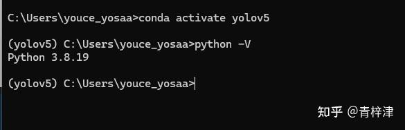  
**方案2**：进入[https://www.python.org/](https://www.python.org/)，点击Downloads

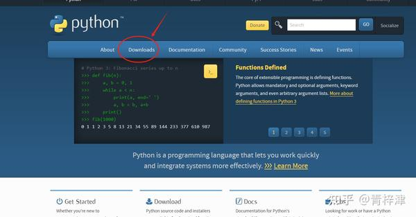  
可以下载自己喜欢的任意版本，也可以与我的版本一致Python3.8.3 （对大部分依赖兼容性好）

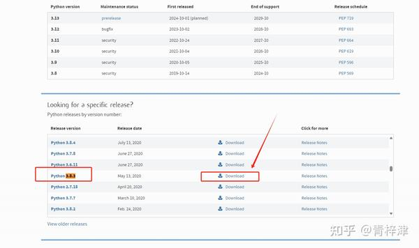  
下载后，一直点下一步安装即可。

### 配置YOLOv5依赖

我们打开yolov5开源地址：[https://github.com/ultralytics/yolov5](https://github.com/ultralytics/yolov5)

把项目现下载到本地

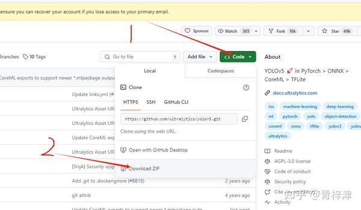  
如果有git环境，也可以直接用以下命令下载

```
git clone https://github.com/ultralytics/yolov5.git
```

下载完后，我们就得到了一个项目文件夹，我们使用[https://code.visualstudio.com/](https://code.visualstudio.com/)（其他编辑器也可以）打开该文件夹

打开后可以点击requirements.txt文件夹

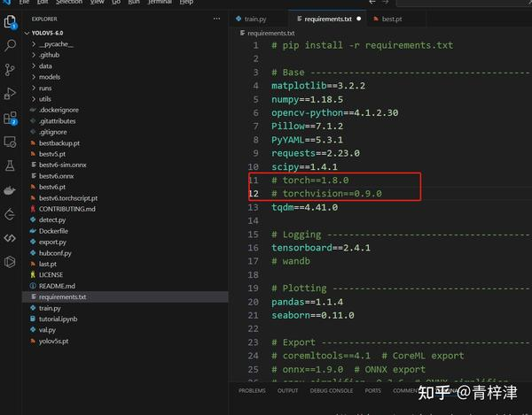  
可以根据我指定的版本号进行修改，避免后续遇到的兼容性问题

```
# pip install -r requirements.txt

# Base ----------------------------------------
matplotlib==3.2.2
numpy==1.18.5
opencv-python==4.1.2.30
Pillow==7.1.2
PyYAML==5.3.1
requests==2.23.0
scipy==1.4.1
# torch==1.8.0
# torchvision==0.9.0
tqdm==4.41.0

# Logging -------------------------------------
tensorboard==2.4.1
# wandb

# Plotting ------------------------------------
pandas==1.1.4
seaborn==0.11.0

thop  # FLOPs computation
```

我把其中的torch和torchvision进行了注释（该版本默认只支持CPU训练），如果电脑没有独立显卡，使用CPU进行训练的话，可以打开注释

修改完成后，执行以下命令安装yolov5依赖

```
pip install -r requirements.txt -i https://pypi.tuna.tsinghua.edu.cn/simple
```

前面没有注释掉torch和torchvision的小伙伴可以跳过这一步

打开P[https://pytorch.org/](https://pytorch.org/)：

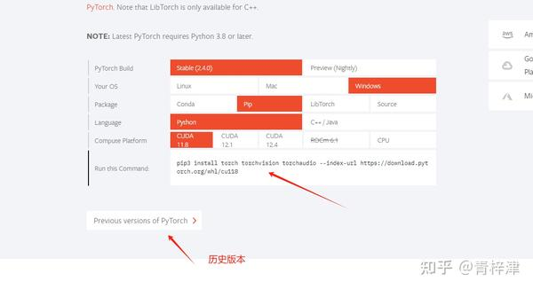  
需要根据自己显卡去下载对应的，简单百度一下，这里就不展开说了。

## 二、数据收集与处理

### 数据采集

我们需要一些训练数据，可以直接在游戏界面截图，或者投屏到电脑软件截取，工具很多，不列举了，如果只是针对布万加的话差不多150张，能够有不错的效果了，尽量让截图中需要识别的物体差异大一点，过多相同的图片会过拟合，导致模型泛化能力弱。关于人物，可以对自己每个角色朝左，朝右，左奔跑，右奔跑，轻微遮挡，放技能过程中的图片各来一张就够。

图片可以裁剪成正方形，训练效果会比较好，我这里写了一个裁剪图片的脚本可以直接运行使用

```
import cv2
import os

# 定义目标尺寸
target_size = (460, 460)

# 定义裁剪位置，可选值为 'left', 'center', 'right'
crop_position = 'center'

current_dir = './img'  # 可以根据实际情况修改为图片所在的路径
for filename in os.listdir(current_dir):
    if filename.endswith('.jpg') or filename.endswith('.png'):
        img_path = os.path.join(current_dir, filename)
        img = cv2.imread(img_path)

        if img.shape[0] < target_size[1] or img.shape[1] < target_size[0]:
            print(f"Skip {filename} due to smaller size than target.")
            continue

        scale_factor = max(target_size[0] / img.shape[1], target_size[1] / img.shape[0])
        scaled_img = cv2.resize(img, None, fx=scale_factor, fy=scale_factor, interpolation=cv2.INTER_LINEAR)

        if crop_position == 'left':
            start_x = 0
        elif crop_position == 'center':
            start_x = int((scaled_img.shape[1] - target_size[0]) / 2)
        elif crop_position == 'right':
            start_x = scaled_img.shape[1] - target_size[0]
        else:
            raise ValueError("Invalid crop_position value. Should be 'left', 'center', or 'right'.")

        start_y = int((scaled_img.shape[0] - target_size[1]) / 2)

        cropped_img = scaled_img[start_y:start_y+target_size[1], start_x:start_x+target_size[0]]

        # 保存裁剪后的图片,覆盖原文件
        output_path = os.path.join(current_dir, filename)
        cv2.imwrite(output_path, cropped_img)

        print(f"Resized and cropped {filename} to {target_size} with crop position {crop_position}.")
```

图片文件夹路径需要进行修改current\_dir 

默认保留图片中间部分，可以修改crop\_position 参数进行修改，可选值为 'left', 'center', 'right'

基本大部分图片截取中间部分就可以了，少量可以截取右侧，为了标注“门”这个分类

完成后进行下一步骤

### 数据标注

这里使用的是([https://labelstud.io/guide/quick\_start](https://labelstud.io/guide/quick\_start))

可以使用以下命令来下载

```
pip install label-studio -i https://pypi.tuna.tsinghua.edu.cn/simple
```

输入以下命令进行启动

```
 label-studio start
```

启动后可以打开地址

随便注册一个账号进行登录，点击右上角的create新建一个标注项目

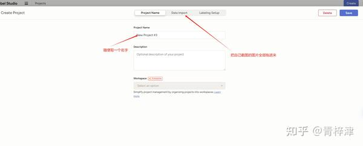  
选择这个标注方式

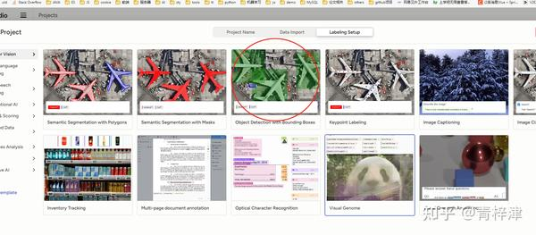  
按照我的几个分类类型，依次添加

```
['Gate' # 门,'Hero' # 玩家人物,'Item' # 掉落物品,'Mark' # 箭头标记,'Monster' # 怪物,'Monster_Fake' # 怪物尸体]
```

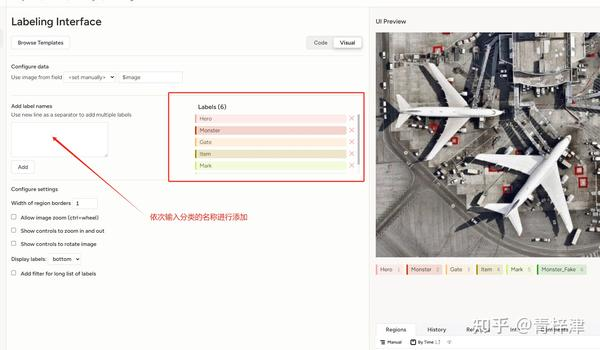  
然后的点击右上角的Save保存即可

我们打开刚刚创建的标注项目,点击Label All Task

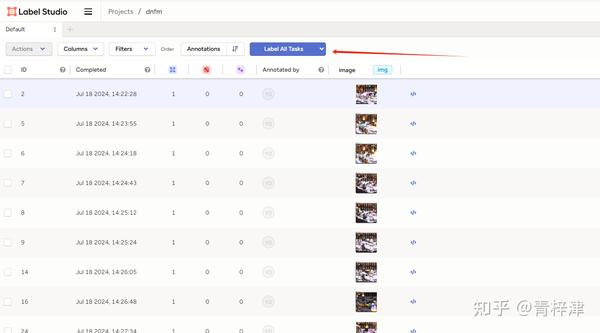  
先点击下方，选择对应的标签，然后在图中进行圈出来对应物体

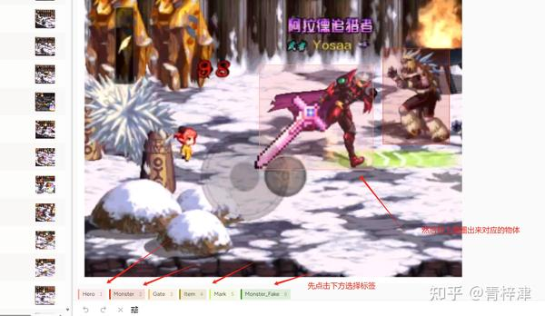  
全部数据标注完成后，点击右上角的Export

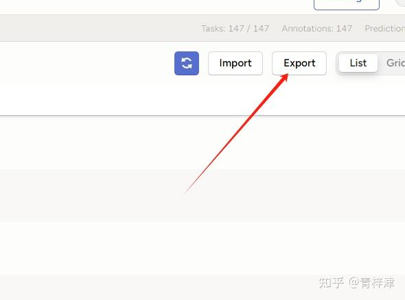  
然后选择yolo格式数据集，进行导出

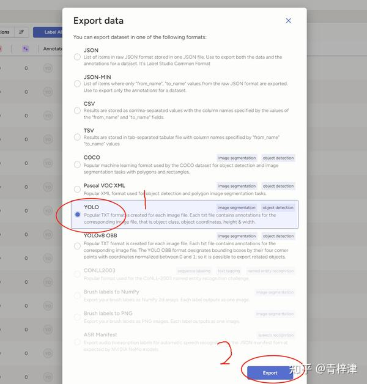  
导出后得到一个图片，以及对应坐标的txt文档

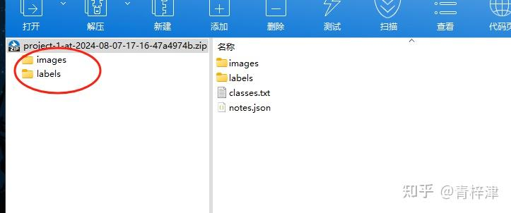  

## YOLOv5 模型训练

可以像我一样在yolov5项目中创建以下目录结构

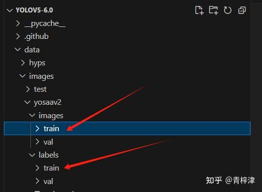  
把导出images文件夹内图片放入images/train文件夹内，可以取部分放入val文件夹内

把导出的labels文件夹内的txt文档放入labels/train内，可以取上方图片对应的文档放入val文件夹内

接着，我们创建一个配置文件，如图所示

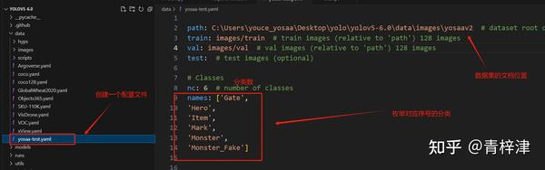  
以下是我的配置：

```
path: C:\Users\youce_yosaa\Desktop\yolo\yolov5-6.0\data\images\yosaav2  # dataset root dir
train: images/train  # train images (relative to 'path') 128 images
val: images/val  # val images (relative to 'path') 128 images
test:  # test images (optional)

# Classes
nc: 6  # number of classes
names: ['Gate',
'Hero',
'Item',
'Mark',
'Monster',
'Monster_Fake']
```

然后执行，data/yosaa-test.yaml对应自己的配置文件路径，--workers 1 --batch-size 8 可以根据自己的显卡配置调高，如果报错了就调低一点

```
 python train.py --weights yolov5s.pt --data data/yosaa-test.yaml --workers  4 --batch-size 8 
```

默认训练300轮，耐心等待就好了（CPU训练会比较慢）

结束后，在runs/train/expXX文件夹内有一个weight权重文件夹，里面的best.pt就是训练后的模型了

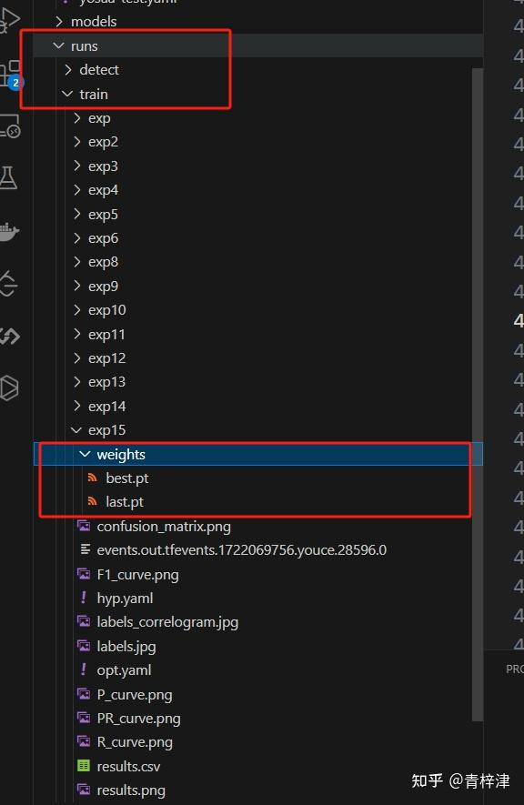  
我们把他拿到根目录，使用下面命令，最后路径是指定一张游戏截图路径，看看模型识别效果

```
python detect.py --weights best.pt --source data\images\yosaa\images\val\2024716133448.jpg
```

执行完后在runs/detect目录下能看到刚刚识别出来的图片

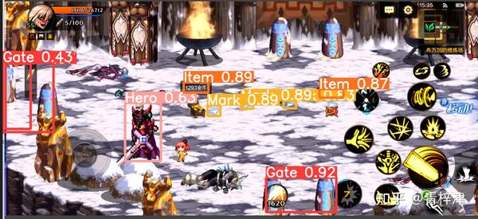  
到此模型训练步骤就完成了

## ADB 命令控制手机

我们新建一个文件夹，开始编写python脚本部分，新建一个py文件，引入以下依赖

```
import pygetwindow as gw
from PIL import ImageGrab
import time
import pyautogui
```

我们需要把手机屏幕投屏到电脑，任意投屏软件都可以，或者GitHub上直接搜索Scrcpy、QtScrcpy之类的工具，更加简单干净

然后编写第一个方法，用于获取窗口长和宽，以及当前投屏窗口画面（代码已经加上详细注释）

```
# 定义一个名为on_frame的方法
def on_frame(self):
    try:
        # gw是pygetwindow依赖，是一个获取窗口列表的函数
        # getWindowsWithTitle是一个方法，用于获取所有包含指定标题的窗口
        # self.window_title是类的一个属性，存储了要捕获的窗口的标题
        # [0]表示获取列表中的第一个窗口，假设只有一个窗口匹配
        window = gw.getWindowsWithTitle(self.window_title)[0]

        # 检查是否成功获取到了窗口对象
        if window:
            # 如果获取到了窗口，调用其restore方法，还原窗口大小
            window.restore()
            # 调用其activate方法，激活窗口，使其成为当前窗口
            window.activate()
            # 使用time.sleep暂停0.1秒，等待窗口完全激活
            time.sleep(0.1)  # 等待窗口完全激活

            # 获取窗口的位置和大小信息
            # left, top是窗口左上角的坐标
            # width, height是窗口的宽度和高度
            x, y, width, height = window.left, window.top, window.width, window.height

            # 将窗口的位置和大小信息存储到self.windowsInfo属性中
            self.windowsInfo = (x, y, width, height)

            # 使用ImageGrab模块的grab方法来截取指定窗口的屏幕图像
            # bbox参数定义了截图的边界框，即窗口的左上角坐标和右下角坐标
            screen = ImageGrab.grab(bbox=(x, y, x + width, y + height))
            # 函数返回截取的屏幕图像
            return screen

    # 捕获并处理在执行上述代码时可能发生的任何异常
    except Exception as e:
        # 打印异常信息
        print(f"An error occurred: {e}")
```

需要修改窗口ID为自己的窗口名称

```
class scrcpyQt:
    def __init__(self, window_title): # 初始化全局参数
        self.window_title = window_title
        self.windowsInfo = (0, 0, 0, 0)

if __name__ == "__main__":
    window_title = "Phone-f0d62d51" # 修改此处为投屏窗口id
```

现在我们就取到了当前的游戏画面，可以通过以下命令进行输出查看渠道的画面是否正确

```
cv.imshow('frame', screen_np)
cv.waitKey(0)
```

然后我们需要编写几个方法用于控制鼠标的操作（通过控制鼠标操作游戏角色）

```
    def touch_start(self, x: int or float, y: int or float):
        pyautogui.moveTo(x, y, duration=0.4)  # 移动到指定位置，持续时间0.4秒
        pyautogui.mouseDown()  # 模拟按下鼠标

    def touch_move(self, x: int or float, y: int or float):
        pyautogui.moveTo(x, y, duration=0.25) # 移动鼠标到指定坐标点

    def touch_end(self, x: int or float, y: int or float):
        pyautogui.mouseUp() # 模拟抬起鼠标
```

可以在main函数上调用试试看，是否能成功控制鼠标，到这一步就完成大半了

## 第二期 [实现Dnfm手游脚本搬砖思路 2 （逐行代码讲解） - 知乎 (zhihu.com)](https://zhuanlan.zhihu.com/p/714876356)

## 如果对你有帮助，记得点赞收藏哈，谢谢
