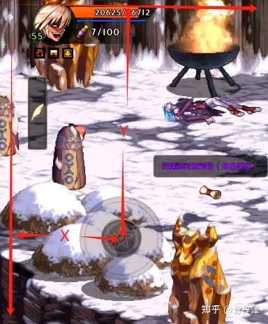
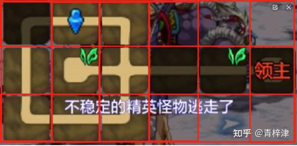

# 实现Dnfm手游脚本搬砖思路 2 （逐行代码讲解）

 **Author:** [青梓津]

 **Link:** [https://zhuanlan.zhihu.com/p/714876356]

## 前言：本文主要使用 YOLOv5 识别游戏画面中的物体，结合 ADB 命令控制手机操作，实现自动化技能释放、拾取物品、寻路和再次挑战等功能，彻底解放双手。本文旨在学习和分析技术思路，不涉及任何商业用途，手把手安装环境，实现代码逐行讲解，0基础也可以跟着做。

**没学习第一期的，可以点击下方卡片前往**

[青梓津：开发一个DNF手游自动化搬砖脚本（逐行代码讲解）](https://zhuanlan.zhihu.com/p/713202919)## 内容大纲：  

* 点击区域配置（移动，攻击，地图等）
* 通用攻击策略及固定打法策略
* 人物地图寻路逻辑
* 房间号判断逻辑
* 判断当前站位是否适合攻击
* 识别技能是否冷却完毕
* 效果展示与总结

## 一、点击区域配置

在上一章节的最后我们实现了鼠标的控制，通过pyautogui.moveTo移动到指定坐标，pyautogui.mouseDown()模拟鼠标按下，pyautogui.mouseUp()模拟鼠标抬起，连在一起，我们可以实现一个点击指定坐标操作

```
    def click(self, x: int or float, y: int or float, t: float = 0.01):
        pyautogui.moveTo(x, y, duration=0.4)
        self.mouseDown()
        time.sleep(t)  # 通过t可以控制点击的持续时间
        self.mouseUp()
```

现在我们需要找到想要点击位置的坐标，比如移动方向键，窗口的左上角坐标为（0,0）

  
为了自己的手机可以更好的适应各种投屏电脑运行环境（不同窗口尺寸通用化），我们用百分比的形式存储坐标位置

例如，图上的方向键的坐标为 $（ X \div 窗口长度， Y \div 窗口宽度）$ 

在需要使用时，在第一章节中已经获取了window.left（窗口左上角的X）, window.top（窗口左上角的Y）, window.width(窗口长度), window.height（窗口宽度）

假设窗口左上角的坐标为（X1, Y1）

窗口高度为H，窗口宽度为W， 方向键的的百分比坐标为（X2， Y2）

那么求当前需要点击的坐标点就可以表示为 $(X1 + W \times X2 , Y1 + H \times Y2)$ 

根据该方式，我们把重要的一些点位进行测量，例如方向控制键、技能、普攻、小地图、再次挑战、副本地图、超300疲劳提示框、日常委托等。

## 二、通用攻击策略及固定打法策略

建议把技能键位修改为基础型，避免挡住物体影响识别准确性

现在我把我的技能坐标都取出来了

```
self.scope_of_skill = {
    "Y": [(0.49, 0.87), (0.71, 0.77), (0.74, 0.88), (0.84, 0.77)],
    "J": [(0.62, 0.88), (0.68, 0.88), (0.77, 0.77), (0.65, 0.77)],
    "JX": [(0.407, 0.9)],
    "Buff": [(0.87, 0.67)],
    "Buff2": [(0.87, 0.67)]
}

self.skill_mapping_by_hero = {
    # 0大锤、1领悟之雷、2往前推的盾、3矛、4唱小歌、5禁锢锁链、6挥三棒、7沐天之光、
    "NM": [
        (0.49, 0.87), (0.54, 0.90), (0.62, 0.88), (0.68, 0.9),
        (0.65, 0.79), (0.72, 0.78), (0.78, 0.796), (0.83, 0.78)
    ],
    # 0鬼影闪、1四阵、2鬼影剑、3鬼影鞭、4冥炎三、5鬼斩、6鬼月绝、7墓碑、
    "GQ": [
        (0.68, 0.9), (0.72, 0.78), (0.62, 0.88), (0.78, 0.796),
        (0.83, 0.78), (0.72, 0.78), (0.65, 0.79), (0.54, 0.90)
    ]
}
```

除了buff和觉醒技能之外，我用两种方式对技能进行了分类

1. scope\_of\_skill 中，我根据技能范围分为Y（远距离）和J（近距离）；远距离指的是不易对贴身目标造成伤害，或者是释放后会往前位移的技能（不应该与怪物贴脸时释放的技能）， 近距离指的是在自己身位周围都可以进行攻击的技能（适合在怪物重合时释放的技能）
2. skill\_mapping\_by\_hero ,根据指定人物，配置常用技能对应坐标，实现精确释放。

简单思路讲解（后续会结合实战代码进行详细介绍）：

1. 通用打法：识别怪物数量、精英怪数量，以及与怪物距离 随机释放 固定次数的Y类技能与J类技能，或者设计多套连招，直接调用连招的形式攻击。以下是一个简单的例子，当只识别到一个怪物，则进行移动到怪物位置执行一轮普攻，如果识别到2个怪物则释放一个J类技能+一轮普攻，如果···········以此略推

```
    def attack_combine(self, num: int):
        if num == 1:
            self.attack()
        elif num < 3:
            self.attack_j()
            self.attack()
        elif num <= 5:
            self.attack_j()
            self.attack_y()
            self.attack()
        else:
            ·····
```

 扩展：根据当前人物装备好坏，可以一个level值，# num += self.level ，比如当前只有1只怪物，由于该人物伤害较低，我们设置了level为2，则他会按照当前房间有3值怪物的情况进行攻击

2. 固定打法：根据当前房间号，释放当前人物指定技能，实现百分百清怪，（房间号如何判断，第四小节会重点讲解），但是我们如果每次进入新房间后进行判断房间号，反而会浪费时间，随着怪物走动也会出现不可预料的情况（比如：第四图的兔人精英怪可能会离开初始区域），所以判断逻辑应该是，房间号默认为0，清理完当前房间怪物并且拾取所有掉落物品后，在进行识路逻辑前，查看当前房间号并记下，当下一次识别窗口存在怪物时，也就是相当于目前房间号为被记下的房间号 + 1，这个时候可以直接进行固定技能的释放，实现刚进房间就迅速清怪。

## 三、人物地图寻路逻辑

当前屏幕截图经过yolo识别后，会返回各种分类被识别到物体的坐标数组

### 1. 核心移动逻辑

要计算摇杆上需要点击的位置以控制人物移动到目标点，我们可以使用向量和三角函数来解决这个问题。首先，我们需要确定人物当前位置到目标点的向量，然后将这个向量映射到摇杆的圆周上。

* 计算从人物到目标点的方向向量

首先，计算从人物当前位置(X1,Y1)到目标点(X2,Y2)的方向向量:

$Direction=(X2-X1，Y2-Y1)$ 

* 归一化方向向量

方向向量需要归一化(即转换为单位向量)，因为摇杆圆周上的点距离圆心的距离总是半径 R:

$Magnitude=\sqrt{(X2-X1)^{2}+(Y2-Y1)^{2}}$ 

$Unit Direction = \left(  \frac{ X2-X1}{Magnitude} , \frac{ Y2-Y1}{Magnitude}  \right) $ 

* 计算摇杆圆周上的点击位置

现在我们已经有了单位方向向量，我们可以将它乘以摇杆的半径 R，然后加上摇杆圆心的坐标(X0,Y0)来得到摇杆圆周上的点击位置:

$Click Position =(X0+R \times Unit Direction_{x},Y0+R \times Unit Direction_{y})$ 

其中：

$ Unit Direction_{x}$ 是归一化方向向量的x分量，即 $ \frac{ X2-X1}{Magnitude} $ 

$Unit Direction_{y}$ 是归一化方向向量的y分量，即 $\frac{ Y2-Y1}{Magnitude}$ 

这样子，我们就求出了人物移动到目标坐标时，鼠标需要点击的坐标了，示例代码如下：

```
def calculate_joystick_click_position(x1, y1, x2, y2, x0, y0, r):

    direction_x = x2 - x1
    direction_y = y2 - y1
    magnitude = math.sqrt(direction_x**2 + direction_y**2)

    if magnitude == 0:
        return x0, y0  # Click at the joystick center (no movement)

    unit_direction_x = direction_x / magnitude
    unit_direction_y = direction_y / magnitude

    click_x = x0 + r * unit_direction_x
    click_y = y0 + r * unit_direction_y

    return click_x, click_y
```

### 2.行为逻辑

由于存在多种分类，所以要根据识别到的物体，来进行对应的行为控制，如果当前存在怪物，优先处理怪物，清理后开始拾取物品，与我们玩家的行为基本是一致的，总体逻辑简化版伪代码如下所示

```
        if hero:
            # 识别到英雄
            # 加Buff，设置一个变量判断本局是否已经加过Buff，触发再次挑战的时候重置
            # 记录当前人物坐标
        else:
            # 未识别到人物
            # 判断是否识别到再次挑战按钮 （点击再次挑战，还需要识别300疲劳提示窗口）
            # 判断是否识别到翻牌界面 （双击固定位置翻牌）
            # 需要记录次数，如果超过3次，则判断为卡墙，需要进行随机移动
            # 如果超过5次，则判断为被怪物围殴，需要连续点击后跳
            # 随机角度移动并普攻

        if monster:
            print(f"发现怪物: {len(monster)}")
            # 执行移动（攻击逻辑有多种情况需要考虑，暂时跳过）
            # 执行攻击
        elif item:
            print(f"拾取物品：{len(item)}")
            # 求距离最近的物品坐标
            # 计算最近的物品距离
            # 根据当前人物面板移动速度比率计算出移速（也可以持续移动方案，但是可能会进错房间）
        elif arrow:
            print(f"发现箭头")
            # 移动至最近距离的箭头
            # 箭头数量大于3时，直接向第二近的箭头移动（实践发现比较流畅）

        elif gate:
            print("发现门")
            # 方案1：如果没有箭头，则移动向最近的门
            # 方案2：标记出上下左右四种类型的门，固定房间号移动向对应门坐标（固定打法这种方案更快）
```

## 四、房间号判断逻辑

### 方案1：

过图期间界面变黑，通过记录过图次数判断当前房间号，简单快捷符合玩家行为逻辑。

* 优点：效率快，容易判断，可以显著提高刷图速度
* 缺点：需要拾取物品如果在门附近，出现走错房间的情况，会让固定打法顺序混乱，稳定性一般

### 方案2：

通过地图中的蓝点来确定玩家位置

* 优点：精确判断房间号，任意位置都可以抵达想要的房间号，完美搭配按角色设定的固定打法
* 确定：影响效率，不符合玩家行为，后期TX可能会有相关检测

实现思路：

对小地图区域进行测量并裁剪

  
根据地图对应的行列数，例如布万家 6 \* 3地图，将该地图分为18等份

  
代码如下：

```
# 从原始图像中裁剪出一部分区域，这部分区域的坐标由变量 y1, y2, x1, x2 确定。
# y1 和 y2 表示裁剪区域在 y 轴（垂直方向）的起始和结束行号。
# x1 和 x2 表示裁剪区域在 x 轴（水平方向）的起始和结束列号。
cropped_image = image[y1:y2, x1:x2]

# 使用 .shape 属性获取裁剪后的图像的维度。
# height 是图像的高度，即行数。
# width 是图像的宽度，即列数。
height, width, _ = cropped_image.shape

# 设置要将图像分割成的行数和列数。
# num_rows 是分割后的行数。
# num_cols 是分割后的列数。
num_rows, num_cols = 3, 6

# 计算每个分割区域的宽度和高度。
# cell_width 是每个列的宽度，通过将图像的总宽度除以列数得到。
# cell_height 是每行的高度，通过将图像的总高度除以行数得到。
cell_width, cell_height = width // num_cols, height // num_rows

# 使用列表推导式生成每个区域的坐标范围。
# 这个列表包含了图像分割后每个小区域的左上角和右下角的坐标。
# 对于每一行（r），每一列（c），计算出该区域的坐标范围。
# 坐标范围由 (起始x, 起始y, 结束x, 结束y) 表示。
region_ranges = [(c * cell_width, r * cell_height, (c + 1) * cell_width, (r + 1) * cell_height) 
                 for r in range(num_rows) 
                 for c in range(num_cols)]
```

地图上的的小蓝点的颜色与地图差异蛮大的，我们用opencv很容易找到这个点坐标，用拾色器可以找出该色块的HSV进行识别，代码如下：

```
def find_blue_color(image: np.ndarray) -> Tuple[int, int]:
    # 将输入的图像从 BGR 颜色空间转换为 HSV 颜色空间。
    # HSV 颜色空间更适合颜色的识别和处理。
    hsv_image = cv.cvtColor(image, cv.COLOR_BGR2HSV)

    # 拾色器工具识别蓝色的 HSV 阈值。
    # 这些参数可能来源于颜色的预定义值或通过实验确定。
    hue_opencv = int(211.72 / 2)  # 色调的阈值，这里对211.72进行了一半的缩放
    saturation_opencv = int(94.98 * 255 / 100)  # 饱和度的阈值，将百分比转换为0-255的数值
    value_opencv = int(93.73 * 255 / 100)  # 亮度的阈值，同上

    # 定义蓝色的 HSV 下界和上界，用于创建掩膜。
    # 这里通过在阈值的基础上加减一定的数值来确定颜色的范围。
    lower_blue = np.array([hue_opencv - 10, saturation_opencv - 15, value_opencv - 15])
    upper_blue = np.array([hue_opencv + 10, saturation_opencv + 15, value_opencv + 15])

    # 使用 inRange 函数根据定义的 HSV 范围创建掩膜。
    # 这个掩膜将图像中的蓝色区域标记为白色，其余区域标记为黑色。
    mask = cv.inRange(hsv_image, lower_blue, upper_blue)

    # 在掩膜上寻找轮廓，只寻找外部轮廓。
    contours, _ = cv.findContours(mask, cv.RETR_EXTERNAL, cv.CHAIN_APPROX_SIMPLE)

    # 如果找到了轮廓，计算第一个轮廓的边界框，并返回框中心的坐标。
    if contours:
        # 计算边界框的坐标和尺寸
        x, y, w, h = cv.boundingRect(contours[0])
        # 返回边界框中心的 x 和 y 坐标
        return x + w // 2, y + h // 2
    else:
        # 如果没有找到轮廓，打印一条消息并返回 (0, 0) 作为默认值。
        print("未找到蓝色区域")
        return 0, 0
```

得到蓝点坐标后，可以直接在之前分割的18个区域里比对，判断蓝色点落在哪个区间，也就是当前房间号了，代码如下：

```
# 使用 for 循环遍历 `region_ranges` 列表，同时使用 enumerate 函数获取每个区域的索引 `r`。
# 同时，解包每个元组，获取区域的边界值。
for r, (left, top, right, bottom) in enumerate(region_ranges):
    # 检查点 `blue_x` 和 `blue_y` 是否在当前区域 `r` 内。
    # 如果点的 x 坐标在区域的左边界和右边界之间，且 y 坐标在上边界和下边界之间，则认为点在该区域内。
    if left <= blue_x <= right and top <= blue_y <= bottom:
        # 如果点在区域内，计算并返回该区域的索引。
        # 索引计算方式是：行索引乘以列数 `num_cols` 加上列索引加 1。
        # 列索引通过在 `region_ranges` 中找到与当前区域边界匹配的第一个元组的索引来确定。
        return r * num_cols + region_ranges.index((left, top, right, bottom)) + 1
```

所以房间号不是按顺序的，第一行分别是1，2，3，4，5，6，第二行······

在固定打法时就可以根据房间号进行释放技能了

其他：进入房间后，再进行判断可能怪物已经开始移动了，所以在清理完怪物，开始寻路前判断一次房间，然后下一次识别到怪物，就是属于进入了新的房间·····

### 狮子头房间特殊处理：

简单来说，识别到当前是房间9，则在寻路前先判断狮子头房间是否已经打过，如果没有则进行固定移动：

方式1： 固定移动，左几秒，右几秒，上几秒，左几秒 （循环移动，直到房间号为8）

方式2：把左侧的门单独训练进模型，当前房间是9时，则朝识别到的左侧门坐标移动（需要偏上一点）

## 五、判断当前站位是否适合攻击

### 1. 判断是否处于一条直线

这通常意味着角色和怪物的Y坐标相同（或非常接近），这样角色可以直接面向怪物进行攻击。只需要计算垂直距离：

```
is_straight_line = abs(ay - hy) <= 100  # 假设100单位内认为是直线对齐
```

### 2. 判断是否面向怪物

```
is_facing_monster = abs(angle_to_monster) <= 30  # 假设角度差在10度内认为是面向怪物
```

满足这两个条件即可攻击：

```
if is_straight_line and is_facing_monster:
    print("当前站位适合攻击")
    # 这里可以添加攻击逻辑
else:
    print("当前站位不适合攻击，需要调整位置")
    # 这里可以添加移动到合适位置的逻辑
```

## 六、识别技能是否冷却完毕

以技能图标为中心，定义一个正方形区域进行截图。从技能图标中心向四周扩散的像素数。获取当前屏幕截图，并根据定义的裁剪区域`crop`来截取技能图标部分。

将截取的技能图标区域转换为灰度图像，以便更容易地识别冷却状态。使用二值化处理将图像转换为黑白两色，其中冷却中的技能图标通常显示为灰色（非零像素），而未冷却的技能图标显示为白色（零像素）。

计算二值化后图像中的非零像素数量，这个数量代表了冷却遮罩的大小。

如果非零像素数量小于设定的阈值`some_threshold`，则认为技能正在冷却中，函数返回`False`。如果非零像素数量大于或等于阈值，则认为技能冷却完成，可以释放，函数返回`True`。

```
    def is_ready(self, skillIndex: int):
        # 获取当前用户的技能位置列表
        skill_position = self.ctrl.skill_mapping[self.ctrl.user][skillIndex]

        # 从中心点向四周扩散的偏移量
        offset = 30  # 可以调整这个值，根据实际情况

        # 判断技能是否冷却的阈值，当像素点小于这个阈值，说明技能正在冷却
        some_threshold = 550  # 可以根据实际情况调整这个阈值

        # 定义截图区域的裁剪范围
        crop = (
            skill_position[0] - offset, skill_position[1] - offset,
            skill_position[0] + offset, skill_position[1] + offset
        )

        # 获取屏幕截图并截取技能图标区域
        skill_icon = self.ctrl.adb.last_screen  # 确保是函数调用
        if skill_icon is None:
            print("未能获取屏幕截图，技能判断失败。")
            return False

        # 裁剪技能图标区域
        skill_icon = skill_icon[crop[1]:crop[3], crop[0]:crop[2]]

        # 将图标转换为灰度图像
        gray_icon = cv.cvtColor(skill_icon, cv.COLOR_BGR2GRAY)

        # 使用二值化处理，分离冷却遮罩
        _, thresholded = cv.threshold(gray_icon, 120, 255, cv.THRESH_BINARY)

        # 计算非零像素数量
        non_zero_pixels = cv.countNonZero(thresholded)
        print(f'技能{skillIndex}非零像素数量:{non_zero_pixels} 阈值:{some_threshold}')

        # 如果非零像素数量小于某个阈值，说明图标是灰色的，技能正在冷却
        if non_zero_pixels < some_threshold:
            print(f"技能 {skillIndex}，正在冷却中...")
            return False
        else:
            print(f"技能 {skillIndex}，完成冷却，可以释放")
            return True
```

## 七、源码

防止出现商业化行为，这里仅提供基础版本的项目，代码已在github上开源，可点击下方前往：

[yosaa/dnfm-auto: 基于yolov5算法的dnf手游搬砖脚本 (github.com)](https://github.com/yosaa/dnfm-auto)提供改进优化思路

1. 实际使用可以将鼠标模拟点击的方案，替换成scrcpy实现的adb命令。仅需要引入import scrcpy，并把touch\_start、touch\_move、touch\_end方法改为adb命令实现
2. 耗时操作：判断是否过图、是否有再次挑战，是否需要修理装备，是否剩余疲劳。该部分可以使用单独子线程执行
3. 通过黑屏判断进入下一个房间，与怪物首次对齐后进行固定打法，仅在房间3，9，15使用小地图判断房间号，提高执行效率并且增加容错纠正能力
4. 固定标识都用opencv来进行识别，识别区域越小，耗时越低。

## 随缘更新，喜欢的点赞收藏
